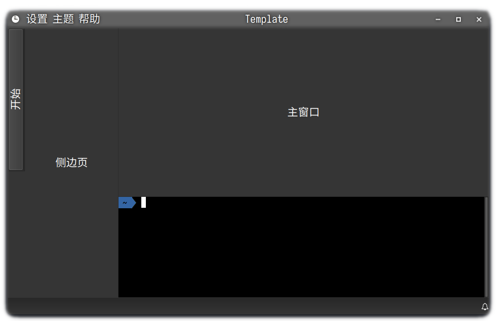
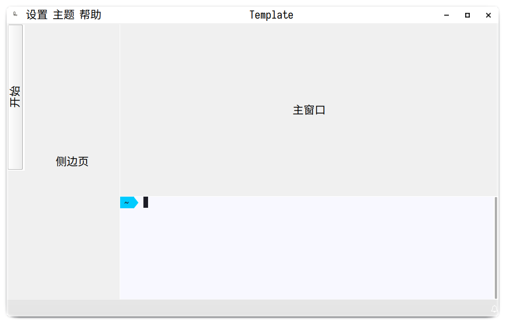

# Quard的Qt应用程序初始模板

本模板是为了方便Quard（本项目作者）创建新的Qt应用程序项目而设计的。它包含了基本的无边框窗口、左侧边页、主页面、底部终端、右侧通知中心，亮/暗色主题切换，顶部与标题栏结合的菜单栏等基本功能。本模板支持跨平台，可以在Windows、Linux、MacOS等系统上运行。需要Qt 6.5.0及以上版本。

## 感谢

本项目代码引用或部份参考或依赖了以下开源项目，项目完全尊重原项目开源协议，并在此表示感谢。

- [QDarkStyleSheet](https://github.com/ColinDuquesnoy/QDarkStyleSheet)
- [QFontIcon](https://github.com/dridk/QFontIcon)
- [qtermwidget](https://github.com/lxqt/qtermwidget)
- [ptyqt](https://github.com/kafeg/ptyqt)
- [iTerm2-Color-Schemes](https://github.com/mbadolato/iTerm2-Color-Schemes)
- [winpty](https://github.com/rprichard/winpty)
- [utf8proc](https://github.com/JuliaStrings/utf8proc)
- [QGoodWindow](https://github.com/antonypro/QGoodWindow)
- [QSourceHighlite](https://github.com/Waqar144/QSourceHighlite)

另外本项目中的部分设计来源于Quard（本项目作者）的另一个项目[quardCRT](https://github.com/QQxiaoming/quardCRT)。
